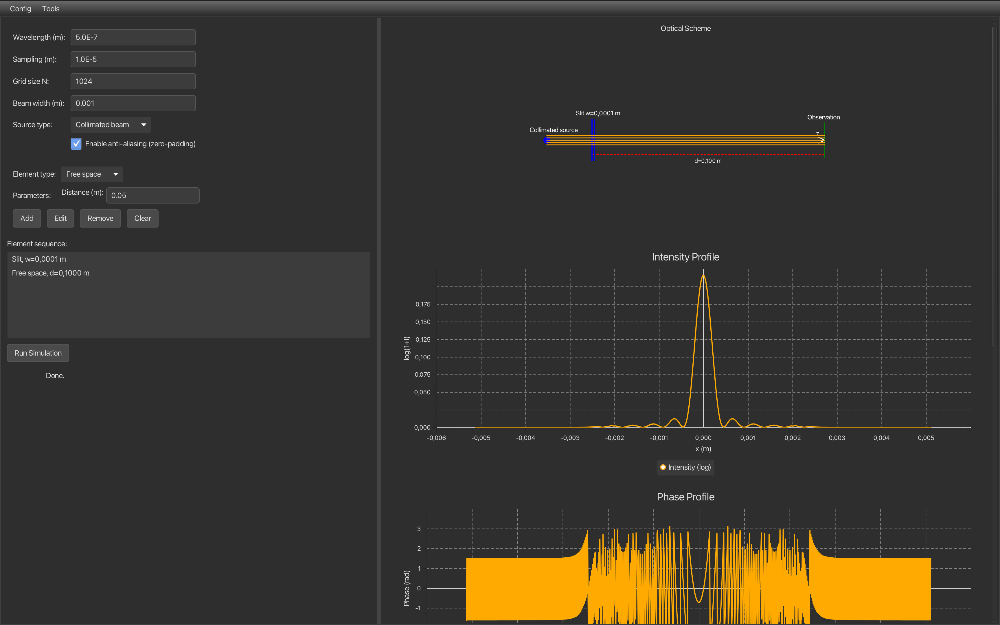

# Wave optics simulation

**A JavaFX-based interactive simulator for monochromatic light propagation through optical elements using the Angular Spectrum Method.**

---

## Features

- **Physics‑accurate simulation** using the Angular Spectrum Method (ASM) with Fast Fourier Transform (FFT).
- **Optical elements**: lenses, mirrors, diffraction gratings, slits, and free‑space propagation.
- **Configurable light sources**: collimated Gaussian beam or point source (spherical wave).
- **Rich visualisation**:
    - 2D colormaps for intensity (log scale) and phase with multiple palettes (Viridis, Jet, Hot, etc.).
    - 1D profiles (intensity & phase) along the horizontal axis.
    - Optical scheme with ray tracing and distance annotations.
    - Zoom, pan, and colorbar for 2D images.
- **Interactive editing**: add, remove, edit elements; drag‑and‑drop reordering; double‑click to delete.
- **Save/Load configurations** in JSON format.
- **Built‑in presets** (free space, lens focusing, slit diffraction, grating diffraction, lens+grating).
- **Beam analysis**: centre of gravity, beam radius (1/e²), FWHM, peak intensity.
- **Performance optimisations**:
    - JTransforms for fast FFT.
    - Caching of phase masks and transfer functions.
    - Multi‑threading for critical loops.
    - Anti‑aliasing (zero‑padding) option.
- **Cross‑platform**: runs on Windows, macOS, Linux (GitHub Actions builds portable apps).

---

## Physics Model

### [Angular Spectrum Method](https://en.wikipedia.org/wiki/Angular_spectrum_method)

The propagation of a monochromatic scalar field `E(x,y)` over a distance `z` is computed as:

1. **Forward FFT** to spatial frequency domain: `Ẽ(fx, fy) = FFT(E)`.
2. **Multiply** by the transfer function:

   `H(fx, fy) = exp(i * k * z * sqrt(1 - (λ fx)² - (λ fy)²))`

3. **Inverse FFT** to obtain the field at the new plane.

Evanescent waves (when the square root is imaginary) are set to zero.

### Optical Elements

All elements are modelled as **phase masks** (or amplitude masks) applied to the complex field:

- **Lens**: `exp(-i * k * (x² + y²) / (2*f))`
- **Mirror**:
    - Flat: phase reversal (`multiply by -1`).
    - Curved: acts as a lens with negative focal length.
- **Grating**:
    - Sinusoidal: `exp(i * amp * (sin(2πx/p)))`
    - Rectangular: step‑wise phase modulation.
- **Slit**: amplitude mask `1` inside `|x| ≤ w/2`, `0` outside.
- **Free space**: propagation via ASM.

---

## Install instructions
### Macos
To run macos app you need to extract zip file, change folder name to OpticsSimulation.app,
then you need to run `codesign --force --deep --sign -path` and patch to your app folder instead word *path* in command.
After that you probably can to try run it. If it not runs go to settings/privacy and security and allow opticsSimulation run.
